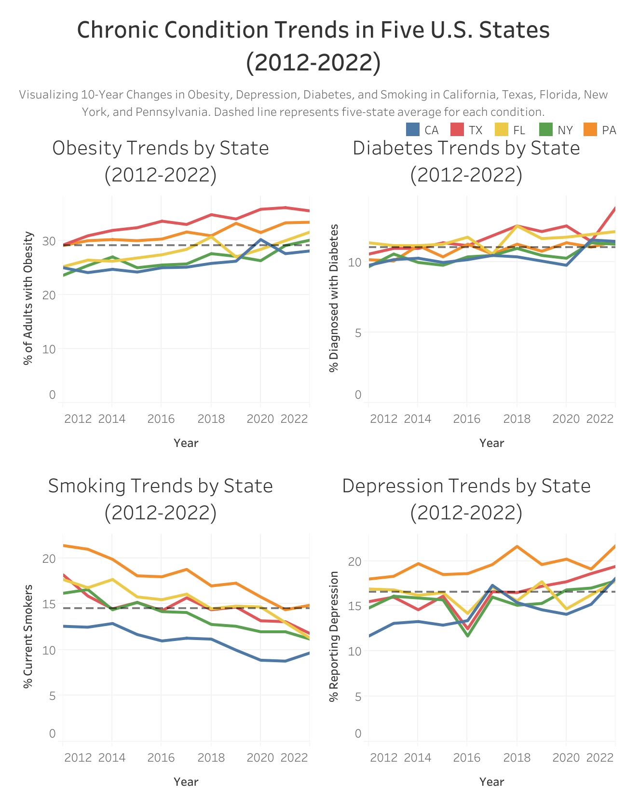
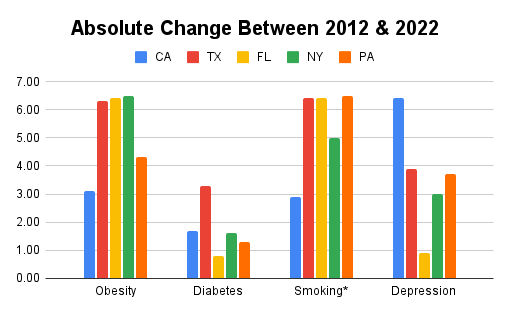

# Chronic Condition Trends (2012-2022): A Decade+ of Public Health Across Five U.S. States

## Overview
This project analyzes 11 years of trends in four major chronic health conditions: **obesity, diabetes, smoking, and depression**. Public health data from the **[CDC Behavioral Risk Factor Surveillance System (BRFSS)](data/data_link.md)** was used to examine changes from 2012 to 2022 across the five most populous U.S. states: **California, Texas, Florida, New York, and Pennsylvania.** 

The goal is to uncover long-term shifts in health outcomes, compare state-level patterns against the five-state average, and pinpoint areas where public health efforts may be most needed. The analysis is designed to help health agencies and decision-makers respond to emerging trends. 

**Reproduce this analysis** → see [How to Reproduce](#How-to-Reproduce).

## Objectives
* Track how **obesity, diabetes, smoking, and depression** changed from 2012 to 2022
* Compare chronic health trends across five of the most populous U.S. states
* Identify states that consistently perform above or below the five-state average
* Highlight shifts that may require targeted public health action
* Display the absolute change from 2012 to 2022 for each state and condition in a bar chart to compare the magnitude of shifts
* Visualize state-level trends through an interactive dashboard designed for public health insights

## Dataset Structure
The dataset originates from the **[CDC BRFSS (Behavioral Risk Factor Surveillance System)](data/data_link.md)** and was processed using Google BigQuery. The raw data was filtered and reshaped to create a clean state-year structure suitable for trend analysis and visualization. 

The final dataset includes:
* **Timeframe:** 2012–2022 (excluding Florida in 2021 due to official CDC omission)
* **States:** California, Texas, Florida, New York, and Pennsylvania
* **Indicators:** Obesity, Diabetes, Smoking, Depression
* **Population Group:** Overall (no demographic subgroups)
* **Measure Type:** Crude Prevalence

The original BRFSS data was structured in **long format**, with each row representing a unique combination of year, state, condition, and prevalence value. Using SQL, the data was pivoted into **wide format**, one row per state-year with separate columns for each health indicator. A **self-join** was applied to calculate **prior-year values** and **year-over-year (YoY) percentage changes**, supporting multi-year comparisons across all five states. 

For complete methodology and analytical rationale, see [notes](work/data_notes.md).

### Units and Metrics
* All condition values are crude prevalence rates and represent the percent of adults age 18 or older. Values are stored as plain numbers. **For example, 5 means 5 percent.**
* The bar chart made in Google Sheets displays absolute point difference between 2022 and 2012. The percentage points are a direct difference between two percentages. For example, 18 percent to 15 percent is a change of 3 percentage points.
* The Tableau dashboarrd line charts plot crude prevalence values by year.
* Year over year percent change is calculated in SQL for QA only and does not appear in the visuals.

## Technical Process
### Data Extraction (SQL)
Public BRFSS data was queried directly from Google Cloud's BigQuery platform. The filtering criteria included:
  * **Indicators:** Obesity, Diabetes, Smoking, Depression
  * **States:** CA, TX, FL, NY, PA
  * **Years:** 2012–2022
  * **Population Group:** Overall
  * **Measure Type:** Crude Prevalence

**Common Table Expressions (CTEs)** were used to organize intermediate transformation steps, and a **pivot operation using (MAX(CASE WHEN...))** reshaped the data from long to wide format, with a column for each health condition. A **self-join** was performed to calculate **prior-year values** and **year-over-year (YoY) percentage changes**. The resulting table was sorted by year and state to support trend analysis and exported to Google Sheets for final processing. 

[View SQL queries](work/sql_queries.sql)

### Data Processing (Google Sheets)
The exported dataset was processed in Google Sheets to finalize calculations and prepare the visualization. Key steps included:
* Applied **conditional formatting** to flag increases and decreases
* Calculated **YoY percent** changes by state and condition
* Organized separate tabs for each condition to simplify analysis
* Created **pivot tables** for trend summaries and internal validation
* Handled Florida's missing 2021 data by adjusting averaging logic
* A bar chart was made to show the absolute value difference between 2022 and 2012

[View spreadsheet and notes](work/sheets)

### Dashboard Development (Tableau)
An interactive dashboard was built in Tableau to help stakeholders explore state-level trends. The dashboard includes:
* Built interactive line charts showing condition-specific changes over time
* Added a dashed reference line to benchmark each trend against the **five-state average**
* Enabled unified filtering by state across all charts for seamless comparison
* Displayed clean tooltips showing the year, state, and prevalence values

For visualization of bar chart and dashboard, see [Visualizations](#Visualizations). 

## Methods and Data Quality
### Data Quality Assurance (QA) checks
* **Ranges:** All prevalence values within 0 to 100 and stored as plain numbers
* **Uniqueness:** Exactly one row per state per year after the pivot
* **Joins:** Prior year join yields null YoY on each state’s first year only
* **Codes:** State abbreviations validated and nulls removed
* **Benchmarks:** Pivot table grand totals match AVERAGEIFS checks for five-state benchmark
* **Florida 2021:** Consistently verified exclusion in SQL, Sheets, and Tableau

### Analytical Choices
* **Prevalence type:** Crude prevalence and the Overall breakout are used throughout for comparisons
* **Benchmarks:** Simple unweighted means using available years only
* **Bar chart:** Show absolute point change between 2012 and 2022
* **Rounding:** For display only and does not drive logic

## Visualizations
The Tableau dashboard illustrates decade-long trends in chronic conditions across the five most populous U.S. states. Each condition is displayed in a side-by-side line chart, with a unified dropdown filter that updates all charts simultaneously. A dashed reference line shows the five-state average as a benchmark. The bar chart displays absolute point difference between 2022 and 2012 made in Google Sheets. 

**Interactive Dashboard**: Explore trends by selecting a state using the filter at the top of the dashboard. Each line chart updates to reflect that state's trajectory over time. 

[View the interactive dashboard here](https://public.tableau.com/views/brfss2/ChronicConditionTrendsinFiveU_S_States2012-2022?:language=en-US&:sid=&:redirect=auth&:display_count=n&:origin=viz_share_link)

**Static Preview**: A static preview of the full dashboard is available below.

**Bar Chart**: A snapshot of the bar chart for the absolute value difference between 2022 and 2012 is shown below. 

## Major Insights
* **Obesity**, **diabetes**, and **depression** all had an overall increase, however only **smoking** had an overall decline.
* Significant dip for **depression** in 2016, specifically for Texas, Florida, and New York. 
* **New York** saw the largest increase in **obesity** (+6.5% points), followed closely by **Florida and Texas** (+6.4% points each).
* **Diabetes** rose most sharply in **Texas**, while **Florida** experience the smallest increase.
* **Smoking** decline across all states, with **Pennsylvania** showing the greatest drop (-6.5% points), followed by **Texas and Florida** (-6.4% percentage points).
* **Depression** increased in all five states, with **Californias** leading and **Florida** having a modest increase.
* **Texas and California** had the **lowest average ranking scores**, relfecting the **most consistently large shifts** in chronic condition indicators over the decade. 

## Recommendations 
* **Investigate the 2016 Depression Dip:** Identify what drove the sharp decline and verify it's not caused by data errors or changes in how rates were calculated. 
* **Strengthen Prevention in High-Change States:** Focus **obesity and diabetes** prevention campaigns in **Texas, California, and New York,** where aboslute changes were the highest.
* **Expand Behavioral Health Resources:** Prioritize mental health funding in **California and Texas,** given the notable rise in depression.
* **Reinforce Anti-Smoking Effects in California:** Despite national progress, **California** lagged in smoking reduction and may benefit from renewed prevention efforts. 
* **Leverage Annual BRFSS Data:** Integrate yearly BRFSS updates into local dashboards to monitor shifts and target interventions in real time.

## Action Plan
* **Report Findings:** Share dashboards and key insights with state-level public health departments and policy leads.
* **Target Interventions:** Deploy region-specific health campaigns based on each state's condition trends and ranking profile.
* **Refine Over Time:** Refresh dashboards and re-run analysis annually as new BRFSS data becomes available. 

## How to Reproduce
1. **Get the source data**
* Open and download dataset [link](data/data_link.md). Save the file(s) where your SQL environment can read them, highly recommend BigQuery.

2. **Run the SQL**: 
* Open and run the [queries](work/sql_queries.sql) in BigQuery.
* Filters:
  * **Years:** 2012–2022
  * **States:** CA, TX, FL, NY, PA
  * **Indicators:** Obesity, Diabetes, Smoking, Depression
  * **Data_Value_Type:** 'Crude Prevalence'
  * **Break_Out:** 'Overall'
* Pivot to columns: Obesity, Diabetes, Smoking, Depression
* Left-join prior year and compute YoY % for QA only (first year per state yields null)
* Save the result as a new table (e.g., your_project.your_ds.brfss_state_year)

3. **Export to the workbook**
* Open [spreadsheet](work/sheets/brfssx.xlsx).
* Paste the BigQuery result into the **Original** tab. Keep these columns from SQL: **Year, LocationAbbr, LocationDesc, Obesity, Diabetes, Smoking, Depression**, plus the prior year columns and **YoY %** columns you computed in SQL for QA. Do not recalculate YoY in Sheets. 
* Create or verify the tabs exist and point formulas to **Original**:
 * **Obesity, Diabetes, Smoking, Depression** tabs: Reference annual prevalence by state, and compute each state’s 10-year average with AVERAGEIFS
   * Example: Overall five-state average → =AVERAGEIFS(D2:D, D2:D, "<>")
   * Example: State average (CA) → =AVERAGEIFS(D2:D, B2:B, "CA", D2:D, "<>")
 * Add conditional formatting that flags above or below the five-state average as documented in the sheet
 * **OPT, DIPT, SPT, DEPT** tabs: Insert pivot tables that summarize averages by year and state; confirm **Grand Totals** match the AVERAGEIFS values on the indicator tabs
 * **OYPT, DIYPT, SYPT, DEYPT** tabs: Create pivot tables over the **YoY %** columns from SQL to review directional patterns. Florida will have fewer intervals because 2021 is missing

4. **Build the Summary tab and bar chart**
* In **Summary** tab, assemble cross-indicator comparisons and the bar inputs:
   * Compute each state’s **10-year average** per indicator
   * Compute the **five-state benchmark** as the simple unweighted mean of state prevalence using **available years only**. Florida 2021 automatically not included in all averages
   * Pull each state’s **2012** and **2022** values per indicator, then compute
     *  **Point change** = Value_2022 - Value_2012
     *   **Absolute change** = ABS(Value_2022 - Value_2012)
   * Build the **bar chart** from **Absolute change** to show magnitude only in **percentage points**
   * Add **above/below benchmark** formatting for the 10-year averages
   * Create **rankings** for each indicator. 1 is highest change absolute point change and 5 is the least absolute point change
   * Compute an **overall average rank** across the four indicators to find final ranking for each state

5. **Build the dashboard in Tableau**
* Connect to the [spreadsheet](work/sheets/brfssx.xlsx) → use the **simplified extract** (Year, LocationAbbr, LocationDesc, Obesity, Diabetes, Smoking, Depression).
* **Create four worksheets** (Obesity, Diabetes, Smoking, Depression):
  * Columns: **Year**. Rows: **AVG([Indicator])**. Color: **LocationAbbr**
* **Add the five-state benchmark as a constant from Sheets**:
  * In each worksheet: Add Reference Line on Y-axis, Then Constant on Computation, and add Paste the indicator's benchmark
  * Format the line style Dashed
* **Filters & layout**: Show **State** filter → **Apply to all using this data source**
* **QA**: Florida 2021 absent, benchmark lines match the Sheet, tooltips show levels (not % change), axes read as percentages
* **Publish**: Publish the interactive Tableau dashboard
* **Maintenance tip**: If benchmarks in Sheets change, update the constant values (or later switch to a Tableau calc if you want it dynamic)

6. **Verify QA**
* Prevalence in **0–100** and stored as plain numbers
* Exactly **one row per state-year** after pivot
* **Florida 2021** absent across SQL, Sheets, and Tableau
* Benchmarks in Sheets match SQL spot checks
* Lines show prevalence values and bar chart shows absolute point change only

## Repository Contents
* README.md – Project overview, technical steps, insights, and recommendations
* data/ – Dataset summary and data source
  * dataset_link.md – Link to CDC BRFSS SMART dataset
* work/ – Project work, including:
  * sql_queries.sql – SQL logic for data filtering and transformation
  * data_notes.md – Detailed justification of technical process and rationale
  * sheets/ - Spreadsheet and spreadsheet documentation
    * brfssx.xlsx – Final spreadsheet with trends and YoY calculations
    * spreadsheet_documentation.md - Explanation of every tab in the spreadsheet
* images/ – Visual outputs and static chart images
  * brfsstgraph.png
  * brfssabsgraph.png
  * brfssob.png
  * brfssog.png
  * brfssopt.png
  * brfssoypt.png
  * brfsstable.png
  * brfssum.png

## Disclaimer
This project is for educational and portfolio purposes only. The dataset is publicly available from the [CDC Behavioral Risk Factor Surveillance System (BRFSS)](data/data_link.md). All rights and data belong to the original source.

