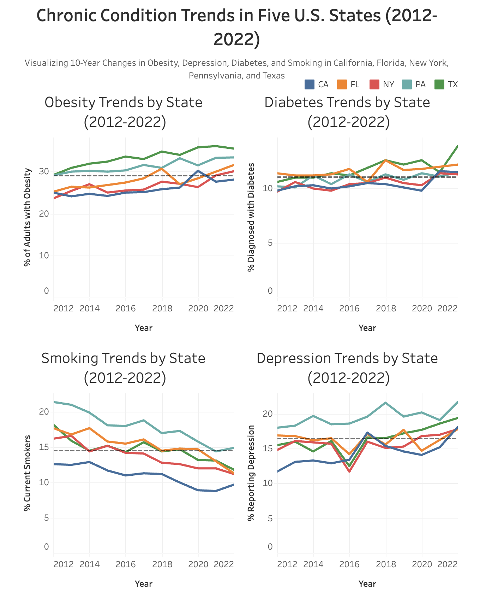

# Chronic Condition Trends (2012-2022): A Decade of Public Health Across Five U.S. States

## Overview
This project analyzes 10 years of trends in four major chronic health conditions: **obesity, diabetes, smoking, and depression**. Public health data from the **[CDC Behavioral Risk Factor Surveillance System (BRFSS)](data/data_link.md)** was used to examine changes from 2012 to 2022 across the five most populous U.S. states: **California, Texas, Florida, New York, and Pennsylvania.** 

The goal is to uncover long-term shifts in health outcomes, compare state-level patterns against the five-state average, and pinpoint areas where public health efforts may be most needed. The analysis is designed to help health agencies and decision-makers respond to emerging trends. 

## Objectives
* Track how **obesity, diabetes, smoking, and depression** changed from 2012 to 2022
* Compare chronic health trends across five of the most populous U.S. states
* Identify states that consistently perform above or below the five-state average
* Highlight shifts that may require targeted public health action
* Visualize state-level trends through an interactive dashboard designed for public health insights

## Dataset Structure
The dataset originates from the **[CDC BRFSS (Behavioral Risk Factor Surveillance System)](data/data_link.md)** and was processed using Google BigQuery. The raw data was filtered and reshaped to create a clean state-year structure suitable for trend analysis and visualization. 

The final dataset includes:
* **Timeframe:** 2012–2022 (excluding Florida in 2021 due to official CDC omission)
* **States:** California, Texas, Florida, New York, and Pennsylvania
* **Indicators:** Obesity, Diabetes, Smoking, Depression
* **Population Group:** Overall (no demographic subgroups)
* **Measure Type:** Crude Prevalence

The original BRFSS data was structured in **long format**, with each row representing a unique combination of year, state, condition, and prevalence value. Using SQL, the data was pivoted into **wide format**, one row per state-year with separate columns for each health indicator. A **self-join** was applied to calculate **prior-year values** and **year-over-year (YoY) percentage changes**, supporting multi-year comparisons across all five states. 

For detailed filtering logic and SQL transformation steps, see [notes](work/data_notes.md).

## Technical Process
### Data Extraction (SQL)
Public BRFSS data was queried directly from Google Cloud's BigQuery platform. The filtering criteria included:
  * **Indicators:** Obesity, Diabetes, Smoking, Depression
  * **States:** CA, TX, FL, NY, PA
  * **Years:** 2012–2022
  * **Population Group:** Overall
  * **Measure Type:** Crude Prevalence

Common Table Expressions (CTEs) were used to organize intermediate transformation steps, and a pivot operation using (MAX(CASE WHEN...)) reshaped the data from long to wide format, with a column for each health condition. A self-join was performed to calculate prior-year values and year-over-year (YoY) percentage changes. The resulting table was sorted by year and state to support trend analysis and exported to Google Sheets for final processing. 

[View SQL queries](work/sql_queries.sql)

### Data Processing (Google Sheets)
The exported dataset was processed in Google Sheets to finalize calculations and prepare the visualization. Key steps included:
* Applied conditional formatting to flag increases and decreases
* Calculated YoY percent changes by state and condition
* Organized separate tabs for each condition to simplify analysis
* Created pivot tables for trend summaries and internal validation
* Handled Florida's missing 2021 data by adjusting averaging logic

[View spreadsheet and notes](work/spreadsheet)

### Dashboard Development (Tableau)
An interactive dashboard was built in Tableau to help stakeholders explore state-level trends. The dashboard includes:
* Built interactive line charts showing condition-specific changes over time
* Added a dashed reference line to benchmark each trend against the **five-state average**
* Enabled unified filtering by state across all charts for seamless comparison
* Displayed clean tooltips showing the year, state, and prevalence values

## Visualizations
The Tableau dashboard illustrates decade-long trends in chronic conditions across the five most populous U.S. states. Each condition is displayed in a side-by-side line chart, with a unified dropdown filter that updates all charts simultaneously. A dashed reference line shows the five-state average as a benchmark.

**Interactive Dashboard**
Explore trends by selecting a state using the filter at the top of the dashboard. Each line chart updates to reflect that state's trajectory over time. 

[View the interactive dashboard here](https://public.tableau.com/views/brfss2/ChronicConditionTrendsinFiveU_S_States2012-2022?:language=en-US&:sid=&:redirect=auth&:display_count=n&:origin=viz_share_link).

**Static Preview**
A static preview of the full dashboard is available below.

## Major Insights
* **Obesity and diabetes** steadily increased from 2012 to 2022 across all five states. Texas and Pennsylvania experienced the steepest rises, signaling elevated long-term risks tied to metabolic and lifestyle-related conditions.
* **Smoking** declined in every state, with **California and New York** showing the most significant reductions—highlighting the impact of sustained anti-smoking policies and public health efforts.
* **Depression** rates rose across the board, most sharply in New York and Florida, underscoring growing behavioral health needs and the increasing demand for mental health services.
* **Texas** consistently reported above-average rates for all four health indicators, while California maintained the lowest rates of obesity and smoking throughout the decade.
* The exclusion of **Florida’s 2021 data,** due to official BRFSS omission, was accounted for in all trend calculations to ensure accurate comparisons.
* These patterns reflect widening disparities in chronic and mental health burdens, with implications for future healthcare costs, state resource allocation, and targeted intervention strategies.

## Recommendations 
* Targeted Health Campaigns: Focus on obesity and diabetes prevention in Texas and Pennsylvania, where rates continue to climb.
* Expand Mental Health Access: Prioritize depression-related services in New York and Florida, especially post-2020.
* Reinforce Anti-Smoking Programs: Continue investment in states like California and New York to maintain downward momentum in smoking.
* Integrate Data Monitoring: Use BRFSS updates annually to guide real-time public health decisions at the state level.

Recommendations
Address Obesity and Diabetes Growth: Focus prevention and intervention efforts in Texas and Pennsylvania where metabolic conditions are rising the fastest.

Support Mental Health Expansion: Prioritize behavioral health funding in Florida and New York in response to increasing depression trends.

Sustain Anti-Smoking Success: Reinforce effective public health strategies in California and New York to maintain progress.

Integrate Data Monitoring: Use ongoing BRFSS releases to track future shifts and adapt public health programs based on real-time trends.

## Action Plan
* Policy Advocacy: Use decade-long trends to inform state health departments and legislators
* Public Education: Highlight state-specific trends in community health campaigns
* Ongoing Monitoring: Refresh analysis yearly as new BRFSS data is released

Action Plan
Report Findings: Share visual dashboards with state health departments and policy partners

Target Interventions: Deploy regional campaigns tailored to condition-specific burdens

Refine Over Time: Update dashboards and trend models as new BRFSS data becomes available

## Repository Contents
* README.md – Project overview, technical steps, insights, and recommendations
* data/ – Dataset metadata and external dataset link
  * dataset_link.md – Link to CDC BRFSS SMART dataset via BigQuery
* work/ – Project work files: SQL queries, spreadsheet files
  * sql_queries.sql – BigQuery SQL code used for data filtering and cleaning
  * data_notes.md – Detailed justification of filtering, logic, and data processing choices
  * sheets/ - Spreadsheet and spreadsheet documentation
    * brfss.xlsx – Final spreadsheet with trends and YoY calculations
* images/ – Visual outputs and static chart images
  * obesity_trend.png
  * smoking_trend.png
  * dashboard_preview.png

Repository Contents
README.md – Project overview, methodology, insights, and recommendations

data/ – Dataset summary and external data source reference

dataset_link.md – Direct link to the CDC BRFSS dataset via BigQuery

work/ – Project artifacts, including:

sql_queries.sql – SQL logic for filtering and transformation

BRFSS_trends.xlsx – Cleaned data with all calculations and checks

data_notes.md – Full documentation of technical process and rationale

images/ – Visualization outputs and condition-specific snapshots

obesity_trend.png, smoking_trend.png, dashboard_preview.png, etc.

## Disclaimer
This project is for educational and portfolio purposes only. The dataset is publicly available from the [CDC Behavioral Risk Factor Surveillance System (BRFSS)](data/data_link.md). All rights and data belong to the original source.

