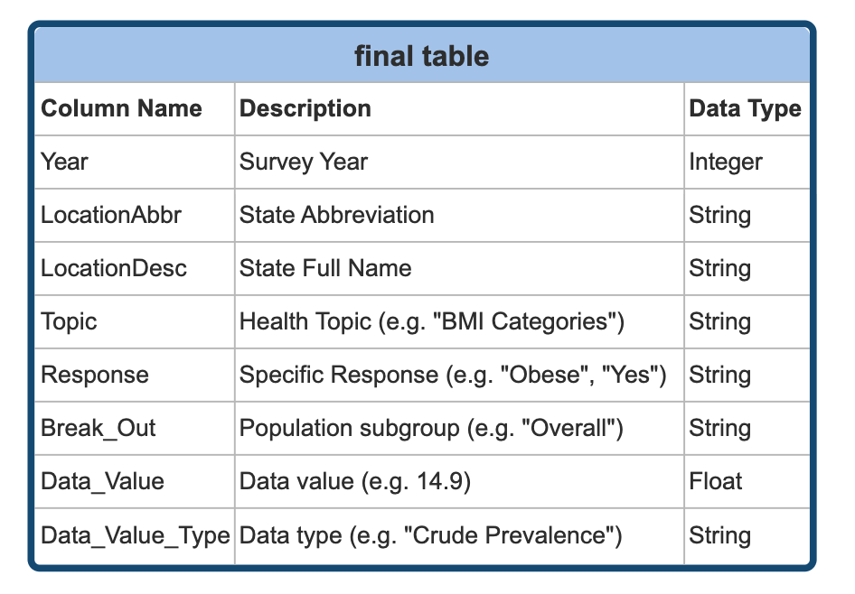
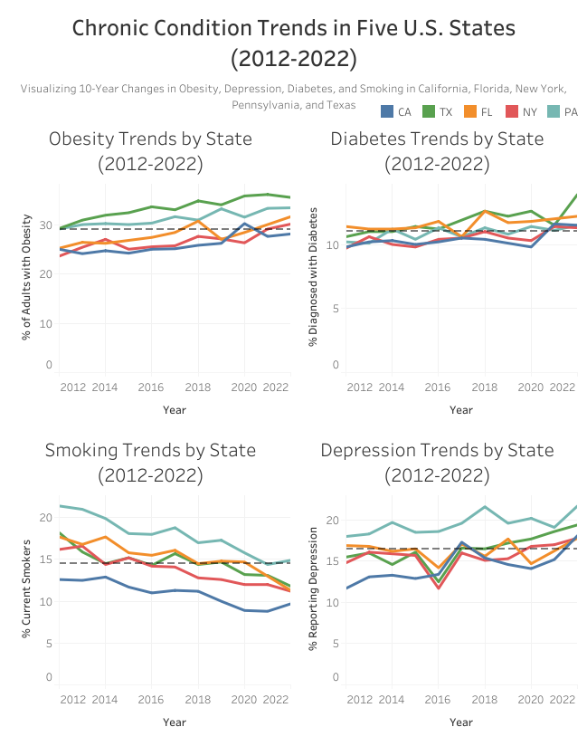

# Chronic Condition Trends (2012-2022): A Decade of Public Health Across Five U.S. States

## Overview
This project analyzes 10 years of trends in four major chronic health conditions: **obesity, diabetes, smoking, and depression**. Public health data from the **[CDC Behavioral Risk Factor Surveillance System (BRFSS)](data/data_link.md)** was used to examine changes from 2012 to 2022 across the five most populous U.S. states: **California, Texas, Florida, New York, and Pennsylvania.** 

The goal is to uncover long-term shifts in health outcomes, compare state-level patterns against the five-state average, and pinpoint areas where public health efforts may be most needed. The analysis is designed to help health agencies and decision-makers respond to emerging trends. 

## Objectives
* Track how **obesity, diabetes, smoking, and depression** changed from 2012 to 2022
* Compare chronic health trends across five of the most populous U.S. states
* Identify states that consistently perform above or below the five-state average
* Highlight shifts that may require targeted public health action
* Visualize state-level trends through an interactive dashboard designed for public health insights

## Dataset Structure
The dataset originates from the **[CDC BRFSS (Behavioral Risk Factor Surveillance System)](data/data_link.md)** and was processed using Google BigQuery. The raw data was filtered and reshaped to create a clean state-year structure suitable for trend analysis and visualization. 

The final dataset includes:
* **Timeframe:** 2012–2022 (excluding Florida in 2021 due to official CDC omission)
* **States:** California, Texas, Florida, New York, and Pennsylvania
* **Indicators:** Obesity, Diabetes, Smoking, Depression
* **Population Group:** Overall (no demographic subgroups)
* **Measure Type:** Crude Prevalence

The original BRFSS data was structured in **long format**, with each row representing a unique combination of year, state, condition, and prevalence value. Using SQL, the data was pivoted into **wide format**, one row per state-year with separate columns for each health indicator. A **self-join** was applied to calculate **prior-year values** and **year-over-year (YoY) percentage changes**, supporting multi-year comparisons across all five states. 

For detailed filtering logic and SQL transformation steps, see [notes](work/data_notes.md).

## Technical Process
### Data Extraction (SQL)
Public BRFSS data was queried directly from Google Cloud's BigQuery platform. The filtering criteria included:
  * **Indicators:** Obesity, Diabetes, Smoking, Depression
  * **States:** CA, TX, FL, NY, PA
  * **Years:** 2012–2022
  * **Population Group:** Overall
  * **Measure Type:** Crude Prevalence

**Common Table Expressions (CTEs)** were used to organize intermediate transformation steps, and a **pivot operation using (MAX(CASE WHEN...))** reshaped the data from long to wide format, with a column for each health condition. A **self-join** was performed to calculate **prior-year values** and **year-over-year (YoY) percentage changes**. The resulting table was sorted by year and state to support trend analysis and exported to Google Sheets for final processing. 

[View SQL queries](work/sql_queries.sql)

### Data Processing (Google Sheets)
The exported dataset was processed in Google Sheets to finalize calculations and prepare the visualization. Key steps included:
* Applied **conditional formatting** to flag increases and decreases
* Calculated **YoY percent** changes by state and condition
* Organized separate tabs for each condition to simplify analysis
* Created **pivot tables** for trend summaries and internal validation
* Handled Florida's missing 2021 data by adjusting averaging logic

[View spreadsheet and notes](work/sheets)

### Dashboard Development (Tableau)
An interactive dashboard was built in Tableau to help stakeholders explore state-level trends. The dashboard includes:
* Built interactive line charts showing condition-specific changes over time
* Added a dashed reference line to benchmark each trend against the **five-state average**
* Enabled unified filtering by state across all charts for seamless comparison
* Displayed clean tooltips showing the year, state, and prevalence values

## Visualization
The Tableau dashboard illustrates decade-long trends in chronic conditions across the five most populous U.S. states. Each condition is displayed in a side-by-side line chart, with a unified dropdown filter that updates all charts simultaneously. A dashed reference line shows the five-state average as a benchmark.

**Interactive Dashboard**
Explore trends by selecting a state using the filter at the top of the dashboard. Each line chart updates to reflect that state's trajectory over time. 

[View the interactive dashboard here](https://public.tableau.com/views/brfss2/ChronicConditionTrendsinFiveU_S_States2012-2022?:language=en-US&:sid=&:redirect=auth&:display_count=n&:origin=viz_share_link)

**Static Preview**
A static preview of the full dashboard is available below.

## Major Insights
* **New York** saw the largest increase in **obesity** (+6.5 percentage points), followed closely by **Florida and Texas**, indicating mounting lifestyle-related health challenges in these states.
* **Diabetes** rose most sharply in **Texas**, while **Florida** experience the smallest increase.
* **Smoking** decline across all states, with **Pennsylvania** showing the greatest drop (-6.5 percentage points), followed by **Texas and Florida** (-6.4 percentage points).
* **Depression** increased in all five states, with **Californias** leading and **Florida** having a modest increase.
* **Texas and California** had the **lowest average ranking scores**, relfecting the **most consistently large shifts** in chronic condition indicators over the decade. 

## Recommendations 
* **Strengthen Prevention in High-Change States:** Focus **obesity and diabetes** prevention campaigns in **Texas, California, and New York,** where aboslute changes were the highest.
* **Expand Behavioral Health Resources:** Prioritize mental health funding in **California and Texas,** given the notable rise in depression.
* **Reinforce Anti-Smoking Effects in California:** Despite national progress, California lagged in smoking reduction and may benefit from renewed prevention efforts. 
* **Leverage Annual BRFSS Data:** Integrate yearly BRFSS updates into local dashboards to monitor shifts and target interventions in real time.

## Action Plan
* **Report Findings:** Share dashboards and key insights with state-level public health departments and policy leads.
* **Target Interventions:** Deploy region-specific health campaigns based on each state's condition trends and ranking profile.
* **Refine Over Time:** Refresh dashboards and re-run analysis annually as new BRFSS data becomes available. 

## Repository Contents
* README.md – Project overview, technical steps, insights, and recommendations
* data/ – Dataset summary and data source
  * dataset_link.md – Link to CDC BRFSS SMART dataset
* work/ – Project work, including:
  * sql_queries.sql – SQL logic for data filtering and transformation
  * data_notes.md – Detailed justification of technical process and rationale
  * sheets/ - Spreadsheet and spreadsheet documentation
    * brfssx.xlsx – Final spreadsheet with trends and YoY calculations
    * spreadsheet_documentation.md - Explanation of every tab in the spreadsheet
* images/ – Visual outputs and static chart images
  * brfsstable.png
  * brfssgeneral.png

## Disclaimer
This project is for educational and portfolio purposes only. The dataset is publicly available from the [CDC Behavioral Risk Factor Surveillance System (BRFSS)](data/data_link.md). All rights and data belong to the original source.

