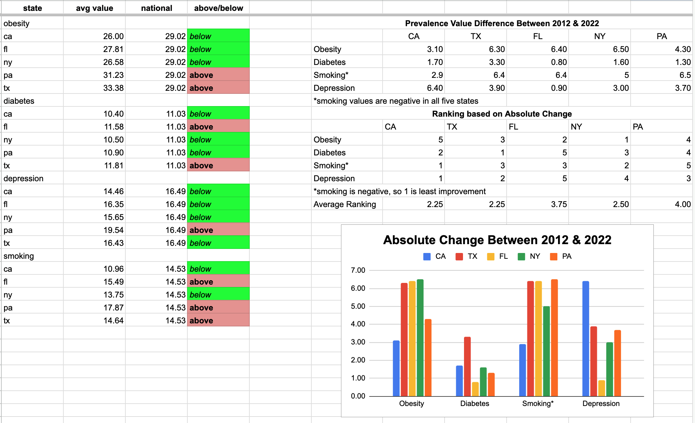

# Spreadsheet Documentation
This document provides a structured overview of each tab within the **[brfssx.xlsx spreadsheet](brfssx.xlsx).** Each tab is explained with its purpose, contents, and relevance to the overall analysis process. Together, these annotations offer transparency into the data preparation, organization, and logic behind the visual and analytical outputs presented in this project.

## Original Tab
This tab contains the full cleaned dataset exported from BigQuery and serves as the foundation for all downstream analysis. It includes annual prevalence values for four chronic health indicators—**obesity, diabetes, smoking,** and **depression**—across five selected U.S. states **(California, Texas, Florida, New York, and Pennsylvania)** from 2012 to 2022.

For each condition, this dataset also includes the **prior year’s value** and the **calculated year-over-year (YoY) percent change**, allowing for clear comparisons over time. Although these columns are grouped by type (all current years, all prior-year values, then all YoY changes), they support accurate trend analysis and helped inform both summary statistics and Tableau visualizations.

## Summary Tab
This tab presents a high-level overview of average prevalence rates (2012-2022) for each condition across all five states, alongside five-state benchmarks for comparison. Conditional formatting highlights whether each state's average is **above or below** the five-state average, making disparities in chronic and behavioral health burdens quickly visible.
In addition to averages, the tab calculates **absolute point changes** (2022 value minus 2012 value) for each indicator by state and a bar graph was made for these values. These differences are then **ranked from highest to lowest change,** with **smoking** rankings reversed to reflect that a larger decline is more favorable. An average ranking was computed across all four indicator to assess each state's overall trajectory. For instance, **Texas and California tied for the most significant overall shifts,** each an average ranking of **2.25**.
This tab synthesizes raw trends and performance-based rankings to help inform which states experienced the greatest health shifts over the decade, serving as a foundation for subsequent insights and recommendations. 

## Obesity Tab
This tab isolates annual **obesity** prevalence data from 2012 to 2022 for five selected U.S. states **(CA, TX, FL, NY, PA)**. It displays year-by-year crude prevalence rates along with calculated year-over-year (YoY) percentage changes for each state. These values support trend analysis and were used to build the Tableau visualizations.

In the second half of the tab, a summary table shows 10-year average **obesity** prevalence rates for each state, alongside an “overall” five-state average calculated across all five states. The following formulas were used:

* **"Overall" Five-State average**: =AVERAGEIFS(D2:D, D2:D, "<>")
* **State-specific averages**: =AVERAGEIFS(D2:D, B2:B, "CA", D2:D, "<>") (replacing "CA" with each state abbreviation)

Conditional formatting highlights individual data points based on whether they are above or below the five-state average:
* **Red**: =D2>$G$2 → Above the five-state benchmark
* **Green**: =D2<=$G$2 → Below or equal to the benchmark

This formatting helps visually emphasize values that deviate from the 10-year average, aiding quick comparison across states and years.

## OPT Tab (Obesity Pivot Table)
This tab contains a pivot table summarizing **obesity** prevalence from 2012 to 2022 across the five selected U.S. states **(CA, TX, FL, NY, PA)**. The table displays average values by year and state, with the **Grand Total row showing the overall 10-year average for each state** and the **Grand Total column showing five-state averages.**

The five-state and state-level averages calculated through this pivot table **match** the values computed using AVERAGEIFS formulas in the corresponding indicator tab **(obesity)**. This validates consistency across methods.

Even though only the overall five-state averages were used in the final visualization, state-specific averages were calculated to explore internal patterns and to support cross-state comparisons in the exploratory phase.

## OYPT Tab (Obesity YoY Pivot Table)
This pivot table displays the **year-over-year (YoY) percentage changes** in **obesity** rates from 2012 to 2022, organized by state. Each row corresponds to a year, and each column represents a selected state. The **"Grand Total"** row calculates the average annual change for each state across the available years.

While these YoY values were not directly visualized in the dashboard, they were used during analysis to explore how consistently or dramatically **obesity** rates changed over time. The pivot table complements the core dataset by summarizing directional trends that can support deeper insights or future recommendations.

* **Note:** **Florida** lacks data for **2021**, resulting in fewer years (8 years instead of 10) of available data for YoY calculations compared to other states. This may slightly impact the average annual change shown in the Grand Total row.

## *Below are explanations for rest of the tabs, however explanations and method are the exact same except for the indicator **(diabetes, smoking, and depression).***

## Diabetes Tab
This tab isolates annual **diabetes** prevalence data from 2012 to 2022 for five selected U.S. states **(CA, TX, FL, NY, PA)**. It displays year-by-year crude prevalence rates along with calculated year-over-year (YoY) percentage changes for each state. These values support trend analysis and were used to build the Tableau visualizations.

In the second half of the tab, a summary table shows 10-year average **diabetes** prevalence rates for each state, alongside an “overall” five-state average calculated across all five states. The following formulas were used:

* **"Overall" Five-State average**: =AVERAGEIFS(D2:D, D2:D, "<>")
* **State-specific averages**: =AVERAGEIFS(D2:D, B2:B, "CA", D2:D, "<>") (replacing "CA" with each state abbreviation)

Conditional formatting highlights individual data points based on whether they are above or below the five-state average:
* **Red**: =D2>$G$2 → Above the five-state benchmark
* **Green**: =D2<=$G$2 → Below or equal to the benchmark

This formatting helps visually emphasize values that deviate from the 10-year average, aiding quick comparison across states and years.

## DIPT Tab (Diabetes Pivot Table)
This tab contains a pivot table summarizing **diabetes** prevalence from 2012 to 2022 across the five selected U.S. states **(CA, TX, FL, NY, PA)**. The table displays average values by year and state, with the **Grand Total row showing the overall 10-year average for each state** and the **Grand Total column showing five-state averages.**

The five-state and state-level averages calculated through this pivot table **match** the values computed using AVERAGEIFS formulas in the corresponding indicator tab **(diabetes)**. This validates consistency across methods.

Even though only the overall five-state averages were used in the final visualization, state-specific averages were calculated to explore internal patterns and to support cross-state comparisons in the exploratory phase.

## DIYPT (Diabetes YoY Pivot Table) 
This pivot table displays the **year-over-year (YoY) percentage changes** in **diabetes** rates from 2012 to 2022, organized by state. Each row corresponds to a year, and each column represents a selected state. The **"Grand Total"** row calculates the average annual change for each state across the available years.

While these YoY values were not directly visualized in the dashboard, they were used during analysis to explore how consistently or dramatically **diabetes** rates changed over time. The pivot table complements the core dataset by summarizing directional trends that can support deeper insights or future recommendations.

* **Note:** **Florida** lacks data for **2021**, resulting in fewer years (8 years instead of 10) of available data for YoY calculations compared to other states. This may slightly impact the average annual change shown in the Grand Total row.

## Smoking Tab
This tab isolates annual **smoking** prevalence data from 2012 to 2022 for five selected U.S. states **(CA, TX, FL, NY, PA)**. It displays year-by-year crude prevalence rates along with calculated year-over-year (YoY) percentage changes for each state. These values support trend analysis and were used to build the Tableau visualizations.

In the second half of the tab, a summary table shows 10-year average **smoking** prevalence rates for each state, alongside an “overall” five-state average calculated across all five states. The following formulas were used:

* **"Overall" Five-State average**: =AVERAGEIFS(D2:D, D2:D, "<>")
* **State-specific averages**: =AVERAGEIFS(D2:D, B2:B, "CA", D2:D, "<>") (replacing "CA" with each state abbreviation)

Conditional formatting highlights individual data points based on whether they are above or below the five-state average:
* **Red**: =D2>$G$2 → Above the five-state benchmark
* **Green**: =D2<=$G$2 → Below or equal to the benchmark

This formatting helps visually emphasize values that deviate from the 10-year average, aiding quick comparison across states and years.

## SPT Tab (Smoking Pivot Table)
This tab contains a pivot table summarizing **smoking** prevalence from 2012 to 2022 across the five selected U.S. states **(CA, TX, FL, NY, PA)**. The table displays average values by year and state, with the **Grand Total row showing the overall 10-year average for each state** and the **Grand Total column showing five-state averages.**

The five-state and state-level averages calculated through this pivot table **match** the values computed using AVERAGEIFS formulas in the corresponding indicator tab **(smoking)**. This validates consistency across methods.

Even though only the overall five-state averages were used in the final visualization, state-specific averages were calculated to explore internal patterns and to support cross-state comparisons in the exploratory phase.

## SYPT Tab (Smoking YoY Pivot Table)
This pivot table displays the **year-over-year (YoY) percentage changes** in **smoking** rates from 2012 to 2022, organized by state. Each row corresponds to a year, and each column represents a selected state. The **"Grand Total"** row calculates the average annual change for each state across the available years.

While these YoY values were not directly visualized in the dashboard, they were used during analysis to explore how consistently or dramatically **smoking** rates changed over time. The pivot table complements the core dataset by summarizing directional trends that can support deeper insights or future recommendations.

* **Note:** **Florida** lacks data for **2021**, resulting in fewer years (8 years instead of 10) of available data for YoY calculations compared to other states. This may slightly impact the average annual change shown in the Grand Total row.

## Depression Tab
This tab isolates annual **depression** prevalence data from 2012 to 2022 for five selected U.S. states **(CA, TX, FL, NY, PA)**. It displays year-by-year crude prevalence rates along with calculated year-over-year (YoY) percentage changes for each state. These values support trend analysis and were used to build the Tableau visualizations.

In the second half of the tab, a summary table shows 10-year average **depression** prevalence rates for each state, alongside an “overall” five-state average calculated across all five states. The following formulas were used:

* **"Overall" Five-State average**: =AVERAGEIFS(D2:D, D2:D, "<>")
* **State-specific averages**: =AVERAGEIFS(D2:D, B2:B, "CA", D2:D, "<>") (replacing "CA" with each state abbreviation)

Conditional formatting highlights individual data points based on whether they are above or below the five-state average:
* **Red**: =D2>$G$2 → Above the five-state benchmark
* **Green**: =D2<=$G$2 → Below or equal to the benchmark

This formatting helps visually emphasize values that deviate from the 10-year average, aiding quick comparison across states and years.

## DEPT Tab (Depression Pivot Table)
This tab contains a pivot table summarizing **depression** prevalence from 2012 to 2022 across the five selected U.S. states **(CA, TX, FL, NY, PA)**. The table displays average values by year and state, with the **Grand Total row showing the overall 10-year average for each state** and the **Grand Total column showing five-state averages.**

The five-state and state-level averages calculated through this pivot table **match** the values computed using AVERAGEIFS formulas in the corresponding indicator tab **(depression)**. This validates consistency across methods.

Even though only the overall five-state averages were used in the final visualization, state-specific averages were calculated to explore internal patterns and to support cross-state comparisons in the exploratory phase.

## DEYPT Tab (Depression YoY Pivot Table)
This pivot table displays the **year-over-year (YoY) percentage changes** in **depression** rates from 2012 to 2022, organized by state. Each row corresponds to a year, and each column represents a selected state. The **"Grand Total"** row calculates the average annual change for each state across the available years.

While these YoY values were not directly visualized in the dashboard, they were used during analysis to explore how consistently or dramatically **depression** rates changed over time. The pivot table complements the core dataset by summarizing directional trends that can support deeper insights or future recommendations.

* **Note:** **Florida** lacks data for **2021**, resulting in fewer years (8 years instead of 10) of available data for YoY calculations compared to other states. This may slightly impact the average annual change shown in the Grand Total row.
